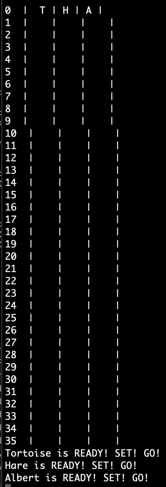

# Tortoise and Hare race

## Instructions
This is a game for the Console showing statistics of sum and frequence for summing up the rolling of two dice.

Open the program in Visual Studio and click play. Click any button and see the race progress, runners are moving forward and sometimes backwards as well :-) until one or more of them are reaching the finish line.

## Screenshots

Below are three screenshots, from the start of race, from the mid of race and from once a winner reaches the finishing line.

## Built with
The project is built in Visual Studio, as a .NET Console Project, with C# as programming language

## Author
* Albert Stjärne (https://github.com/AlbertStjarne)
